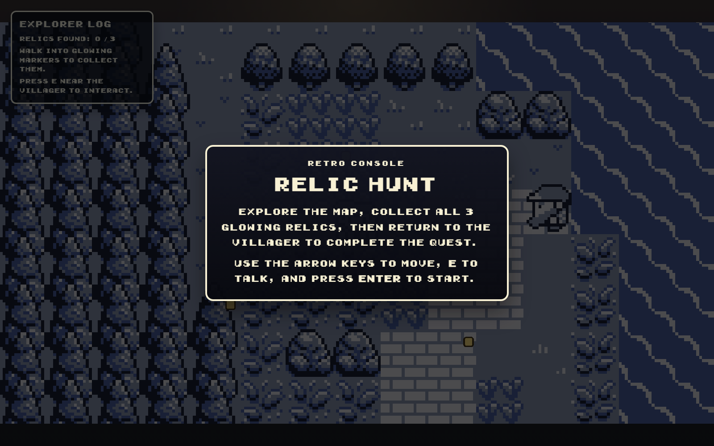
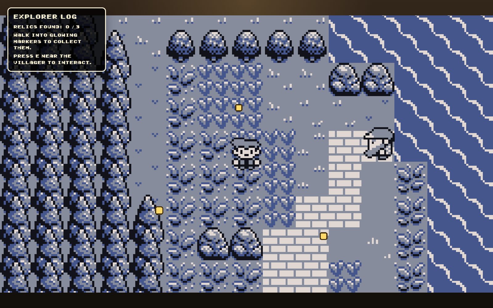

# Retro Game

A small pixel-art adventure game built with React and Kaplay.  
You explore the map, collect glowing relics, talk to the villager, and finish a short quest loop with a proper start and end screen.

## Screenshots

### Start Screen



### Gameplay



## Features

- Retro-styled overworld with a pixel-art map
- Start screen and quest-complete ending screen
- 3 collectible relics placed around the map
- Live HUD showing relic progress
- Dialogue box with animated open/close behavior
- `E` key interaction for talking to the villager
- `R` key replay flow on the ending screen

## Controls

- `Enter` - Start the game
- `Arrow Keys` - Move the player
- `E` - Talk to the villager when nearby
- `Space` - Close the dialogue box
- `R` - Restart after finishing the quest

## Game Loop

1. Start the game from the intro screen.
2. Explore the map and collect all 3 relics.
3. Return to the villager.
4. Finish the quest and view the ending screen.

## Tech Stack

- React
- Vite
- Kaplay
- Jotai
- Framer Motion

## Getting Started

### Install dependencies

```bash
npm install
```

### Run the dev server

```bash
npm run dev
```

Then open the local URL shown by Vite, usually:

```text
http://localhost:5173
```

## Project Structure

```text
src/
  ReactUI.jsx
  main.jsx
  index.css

ReactComponents/
  initGame.js
  kaplayCtx.js
  store.js
  TextBox.jsx
  TextBox.css

public/
  background.png
  character.png
  gameboy.ttf
```

## Notes

- The game UI is handled with React.
- The movement, world objects, and collectibles are handled with Kaplay.
- Shared game state like dialogue, relic count, and phase flow is managed with Jotai.
